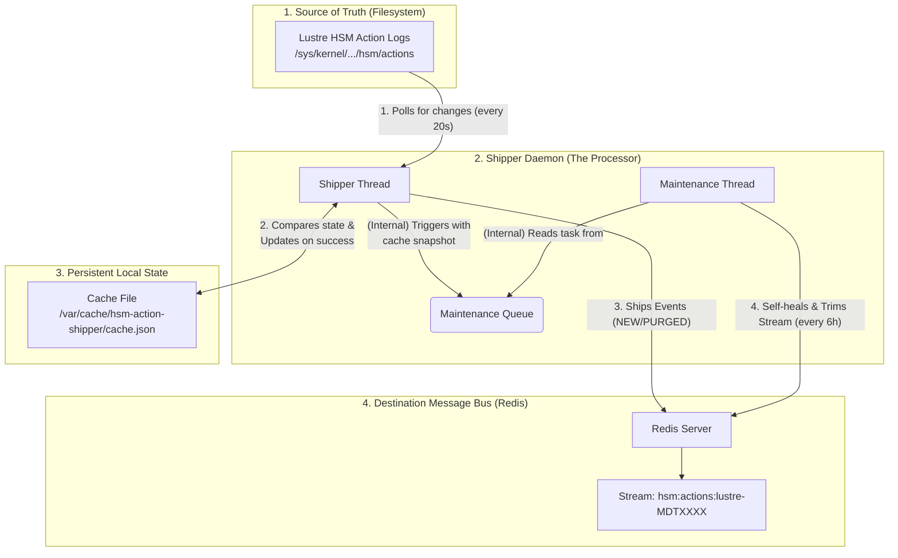
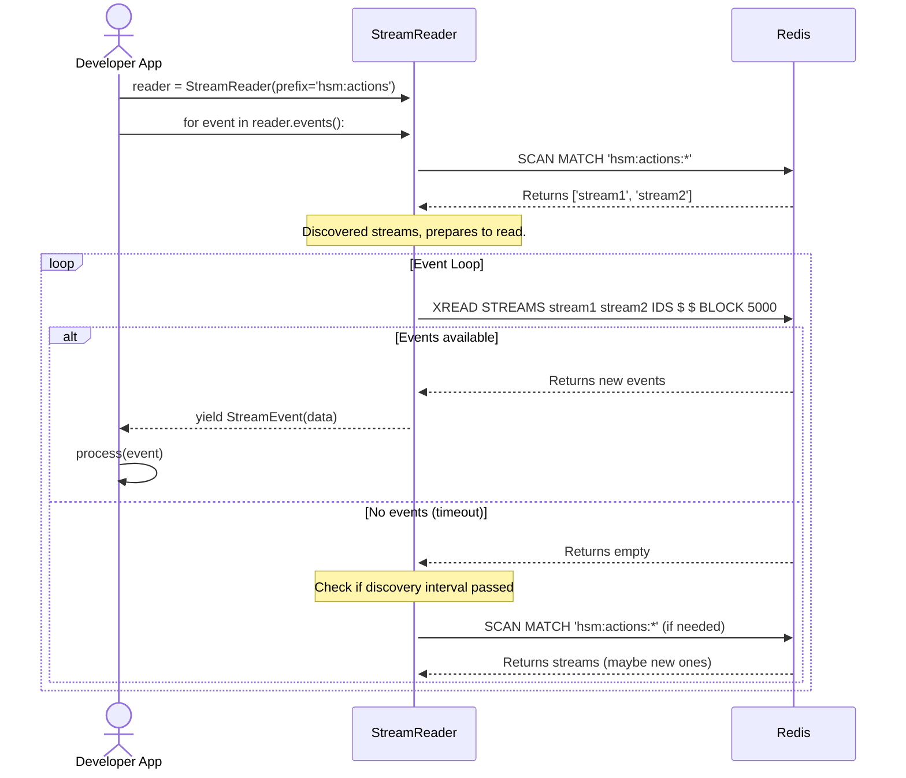

# Lustre HSM Action Stream - Design and Architecture

This document outlines the design and architecture of the `lustre-hsm-action-stream` system, which consists of two main components: the **Shipper** (`hsm-action-shipper`) and the **Consumer API** (`StreamReader`).

## 1. Overview

The primary goal of this system is to reliably and efficiently transport Lustre HSM "action" events from the Lustre Metadata Target (MDT) log files to a centralized, persistent, and easily consumable message bus. This enables real-time monitoring, auditing, and automation based on HSM activity.

-   **The Shipper** is a long-running daemon responsible for watching the action log files, parsing events, and "shipping" them to dedicated Redis Streams. It also performs self-healing and garbage collection on these streams.
-   **The Consumer API** is a Python library that provides a simple, high-level interface for other applications to discover and read events from the streams created by the shipper.

The system is designed for **robustness**, **scalability**, and **low operational overhead**.

## 2. Core Concepts

-   **Action Log Files**: The source of truth. These are plain text files on each MDT that log HSM requests. The default path discovered by the shipper is `/sys/kernel/debug/lustre/mdt/*-MDT????/hsm/actions`. Each line represents a unique action with a catalog index (`cat_idx`) and record index (`rec_idx`).
-   **Redis Streams**: The transport mechanism. A Redis Stream is an append-only, persistent log data structure. The shipper organizes events into per-MDT streams using a configured prefix (default: `hsm:actions`). It's a perfect fit for this use case because it provides:
    -   Guaranteed ordering of messages.
    -   Persistent storage on Redis DB `1` (by default).
    -   Efficient consumption by multiple clients.
    -   Unique, time-based message IDs (`<timestamp_ms>-<sequence>`).
-   **Ground Truth vs. Stream State**: This is the central concept for the self-healing maintenance logic.
    -   **Ground Truth**: The state of actions as represented by the **current contents of the MDT action log files** and the shipper's local cache. If an action is in the file, it's considered "live".
    -   **Stream State**: The state of actions as inferred by **replaying all the events in a Redis Stream**. An action is considered "live" if it has been added (`NEW`/`UPDATE`) and not subsequently removed (`PURGED`).
-   **Event Types**: The shipper generates three types of events:
    -   `NEW`: A new action has appeared in the log file.
    -   `UPDATE`: An existing action in the log file has changed its content (rare, but possible).
    -   `PURGED`: An action that was previously in the log file has been removed (i.e., the HSM request is complete).

## 3. Shipper Architecture

The shipper is a multi-threaded daemon designed for resilience and transactional integrity. It consists of a primary **Shipper Thread** and a background **Maintenance Thread**.



### 3.1. Shipper Thread (Polling & Shipping)

This thread is the engine of the system. It runs in a continuous loop (`do_shipper_poll_cycle`) governed by the `poll_interval` (default: **20 seconds**).

1.  **Discover & Read**: It uses `mdt_watch_glob` (default: `/sys/kernel/debug/lustre/mdt/*-MDT????/hsm/actions`) to find all relevant action log files. It reads the full content of each file safely.
2.  **State Comparison**: For each line in a file, it computes a hash and compares it against the state stored in its in-memory cache.
    -   A line in the file but not in the cache is a **`NEW`** event.
    -   A line in the file with a different hash than the cache is an **`UPDATE`** event.
    -   A key in the cache but not in any file is a **`PURGED`** event.
3.  **Transactional Shipping**: It gathers all detected events into a batch. It then uses a Redis `PIPELINE` to `XADD` all events to their respective streams (e.g., `hsm:actions:lustre-MDT0000`).
4.  **Cache Update**: **Only if the Redis pipeline executes successfully**, the in-memory cache is updated to reflect the new state, and this new cache is atomically saved (default path: `/var/cache/hsm-action-shipper/cache.json`). This transactional "ship-then-save" model ensures that if the shipper crashes, no state change is lost.

### 3.2. Maintenance Thread (Validation & Garbage Collection)

This thread runs periodically, triggered by the Shipper thread after the `reconcile_interval` (default: **21600s / 6 hours**). It is responsible for ensuring the long-term health and bounded size of the Redis streams.

1.  **Replay Stream**: For each MDT it manages, it reads the *entire* Redis stream from beginning to end to build an in-memory view of all "live" actions from the stream's perspective.
2.  **Validate Consistency**: It compares this "stream state" against the "ground truth" (the cache snapshot provided by the shipper).
    -   If an action is "live" in the stream but does not exist in the ground truth, it is an **orphan**.
    -   The thread corrects this by injecting a new `PURGED` event into the stream for each orphan found. This makes the stream **self-healing**.
3.  **Garbage Collect (Trim)**: After validation, to prevent streams from growing indefinitely, the thread performs garbage collection.
    -   It finds the **oldest stream ID** among all remaining live actions.
    -   It uses the `XTRIM MINID` command to delete all events older than this ID. By default, this is done efficiently using `approximate=true` and in batches of `trim_chunk_size` (default: **1000**). This surgically removes historical data that is no longer relevant.
    -   If no live actions remain, it trims the entire stream (`XTREM MAXLEN 0`).

### 3.3. State and Resilience

-   **Cache File**: The cache file is critical for detecting `PURGED` events and preventing the re-shipping of known events on restart. It acts as the shipper's persistent memory.
-   **`RedisConnector`**: A simple wrapper that provides automatic, exponential-backoff reconnection to Redis, making the daemon resilient to transient network issues or Redis restarts.
-   **Graceful Shutdown**: The use of `signal` handlers and a global `threading.Event` ensures that on `SIGINT` or `SIGTERM`, all threads are cleanly stopped, and the final cache state is saved.

## 4. Consumer API Architecture

The consumer is a library, not a daemon. It provides a `StreamReader` class that simplifies reading events from the streams created by the shipper by abstracting away the complexities of Redis, automatic discovery, and multi-stream reading.



### 4.1. Key Features

-   **Automatic Stream Discovery**: On startup and periodically (`discovery_interval`), the `StreamReader` uses the `SCAN` command to find all streams in Redis that match the configured `prefix`. This allows consumers to automatically start listening to new MDT streams as they come online.
-   **Multi-Stream Consumption**: It uses a single `XREAD` command to listen to all discovered streams simultaneously. This is highly efficient, as it requires only one blocking call to Redis.
-   **Flexible Reading Modes**: The `events()` generator supports two main modes:
    -   **Tailing (default)**: Starts reading only new events that arrive after the consumer connects.
    -   **Replaying (`from_beginning=True`)**: Reads all events from the very beginning of each stream's history before tailing new ones.
-   **Resilience**: Like the shipper, it includes automatic reconnection logic to handle network interruptions.
-   **Simple Interface**: It yields a clean `StreamEvent` namedtuple, which deserializes the JSON payload and provides easy access to the event's data, stream name, and ID.

## 5. Event Structure

All events shipped to the stream are JSON objects. The structure is designed to be self-descriptive. The `action_key` (a combination of FID and action type) is crucial, as it uniquely identifies an operation and is used by the maintenance thread to track the lifecycle of an action.

Below are actual examples retrieved from a live system.

**Example `NEW` Event:**
This event represents a new `ARCHIVE` action that has just appeared in the MDT's action log.

```json
{
  "cat_idx": 517,
  "rec_idx": 42068,
  "fid": "0x2c000596f:0x1ce71:0x0",
  "action": "ARCHIVE",
  "status": "STARTED",
  "event_type": "NEW",
  "mdt": "elm-MDT0003",
  "timestamp": 1759619143,
  "raw": "lrh=[type=10680000 len=192 idx=517/42068] fid=[0x2c000596f:0x1ce71:0x0] dfid=[0x2c000596f:0x1ce71:0x0] compound/cookie=0x0/0x6912db05 action=ARCHIVE archive#=1 flags=0x0 extent=0x0-0xffffffffffffffff gid=0x0 datalen=50 status=STARTED data=[7461673D6D]",
  "action_key": "0x2c000596f:0x1ce71:0x0:ARCHIVE"
}
```

**Example `PURGED` Event:**
This event signifies that a previously "live" action has been removed from the action log, meaning the HSM operation is complete. The payload includes fields from the shipper's cache, such as the original `hash`.

```json
{
  "event_type": "PURGED",
  "mdt": "elm-MDT0003",
  "cat_idx": 517,
  "rec_idx": 45417,
  "timestamp": 1759626503,
  "status": "PURGED",
  "action_key": "0x2c0005982:0xbc9:0x0:ARCHIVE",
  "hash": "99170513ec7718e7221714d3f6126984",
  "action": "ARCHIVE",
  "fid": "0x2c0005982:0xbc9:0x0"
}
```
