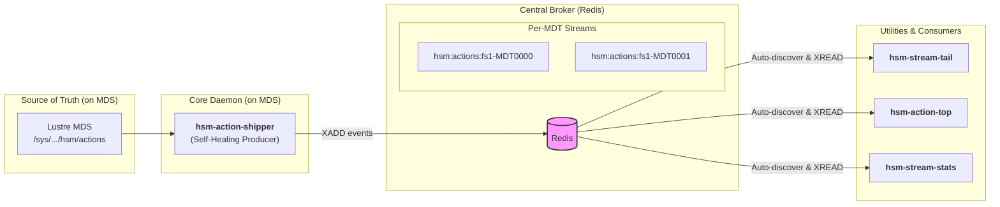

# Lustre HSM Action Stream

[](https://github.com/stanford-rc/lustre-hsm-action-stream/actions/workflows/ci.yml)
[](https://www.gnu.org/licenses/gpl-3.0)

A scalable toolkit for creating a real-time event stream from Lustre's Hierarchical Storage Management (HSM) actions. The system provides a self-healing producer daemon (`hsm-action-shipper`) that runs on each Lustre Metadata Server (MDS) and a collection of consumer utilities for monitoring, metrics, and auditing.

It is designed to give administrators and developers a persistent, reliable, and easily consumable view of all HSM activity across a Lustre file system, transforming the volatile `hsm/actions` log into a robust message bus.

## Core Features

If you manage a Lustre filesystem with an HSM backend, this toolkit solves common monitoring challenges by providing:

*   **A Centralized View:** A single Redis instance becomes the central broker for all HSM events (`archive`, `restore`, `remove`) from all MDTs.
*   **Live Monitoring & Reporting:** Use `hsm-action-top` for a live `top`-like dashboard of HSM activity or `hsm-stream-tail` to see a real-time log of events with file paths.
*   **Metrics for Observability**: Use the stateless `hsm-stream-stats` tool to generate point-in-time JSON reports, ideal for integration with monitoring systems like Telegraf and Grafana.
*   **Operational Simplicity:** The core `hsm-action-shipper` daemon is self-healing and self-managing. It automatically handles MDT failovers, prevents data loss from race conditions, and performs its own efficient garbage collection, requiring minimal administrative overhead.
*   **Extensibility:** A simple Python API allows you to easily build custom consumers to trigger workflows based on HSM events.

## Consumer Tools in Action

#### `hsm-action-top`: The Live Dashboard
A `top`-like terminal dashboard for real-time monitoring of HSM activity. Can also be run with `--run-once` to print a single frame and exit.
```
--- Lustre HSM Action Dashboard ---
Time: 2025-10-02 10:30:15 | Redis: Connected
Viewer Status: Listening for live updates...
Live Actions: 351,204 | Total Events Processed: 750,112 | Last Event: 0s ago

--- Live Action Count by (MDT, Action, Status) ---
MDT         | ACTION  | STATUS     |      COUNT DIFF
----------------------------------------------------------
elm-MDT0000 | ARCHIVE | STARTED    |     50,000
elm-MDT0000 | ARCHIVE | WAITING    |     25,000
elm-MDT0001 | RESTORE | STARTED    |        125 (+5)
...
```

#### `hsm-stream-tail`: The Real-Time Log
A `tail -f` for your HSM actions, resolving file paths for easy identification.
```bash
$ hsm-stream-tail
Tailing streams with prefix 'hsm:actions:*'. Press Ctrl+C to exit.
...
2025-10-02 10:32:05 [elm-MDT0001] RESTORE  STARTED  -> /lustre/project/data/simulation_run_42/output.dat
2025-10-02 10:32:07 [elm-MDT0002] ARCHIVE  SUCCEED  -> /lustre/project/data/raw/microscope_img_22.tiff
```

#### `hsm-stream-stats`: The Metrics Collector
Generates a point-in-time JSON report, perfect for ingestion by monitoring tools.
```bash
$ hsm-stream-stats
{
  "summary": { "total_live_actions": 351204, ... },
  "breakdown": [
    { "mdt": "elm-MDT0000", "action": "ARCHIVE", "status": "STARTED", "count": 50000 },
    ...
  ],
  ...
}
```

## Integration with Monitoring (Telegraf)

The `hsm-stream-stats` tool is designed for easy integration with monitoring systems. Here is an example configuration for Telegraf to collect these metrics periodically.

Place the following content in `/etc/telegraf/telegraf.d/hsm-stream-stats.conf`:
```toml
# Collect metrics from the Lustre HSM action stream
[[inputs.exec]]
  interval = "60s"
  commands = ["/usr/bin/hsm-stream-stats -c /etc/lustre-hsm-action-stream/hsm_stream_stats.yaml"]
  timeout = "5m"
  data_format = "json_v2"

  [[inputs.exec.json_v2]]
    measurement_name = "hsm_stream_stats"

    # Process the 'summary' object, creating fields for each key-value pair.
    [[inputs.exec.json_v2.object]]
      path = "summary"

    # Create a separate metric point for each stream, tagged by MDT.
    [[inputs.exec.json_v2.object]]
      path = "streams"
      tags = ["mdt"]

    # Process each object in the 'breakdown' array, creating detailed metrics
    # tagged by mdt, action, and status. This is ideal for Grafana dashboards.
    [[inputs.exec.json_v2.object]]
      path = "breakdown"
      tags = ["mdt", "action", "status"]
      # The remaining key ('count') will become a field.
```
This configuration uses Telegraf's `inputs.exec` plugin to run `hsm-stream-stats` every 60 seconds and parse its JSON output, creating rich, queryable metrics in your time-series database.

## Architecture Overview

The system consists of a producer daemon (`hsm-action-shipper`) that runs on each MDS and consumer utilities that read from a central Redis message bus. The shipper creates a separate Redis Stream for each MDT it monitors.

For a complete technical breakdown, including data flow, self-healing logic, and thread architecture, please see the [**DESIGN.md**](./DESIGN.md) document.



## Installation

This project is designed to be built into an RPM for easy deployment on RHEL-based systems.

### Prerequisites
*   A running **Redis** server (version 6.2 or later) accessible from all Lustre MDS nodes.
*   Lustre client tools (`lfs`) installed on machines where you run `hsm-stream-tail`.
*   Build tools: `rpm-build`, `python3-devel`, `pyproject-rpm-macros`.

### 1. Build the RPM
Clone the repository and use `rpmbuild` to create the package.
```bash
git clone https://github.com/stanford-rc/lustre-hsm-action-stream.git
cd lustre-hsm-action-stream
# Create a source tarball and build the RPM
rpmbuild -ta lustre-hsm-action-stream-<version>.tar.gz
```

### 2. Deploy on Lustre Metadata Servers (MDS)
Install the generated RPM on **each** of your Lustre MDS nodes.

```bash
# On each MDS:
dnf install python-lustre-hsm-action-stream-<version>-1.el9.noarch.rpm
```

> **Important Note on Upgrading:**
> When upgrading from a previous version, you must start with a clean state to ensure consistency. Stop the service on all nodes, delete the old Redis streams (`FLUSHDB` or `DEL`), and delete the cache file (`/var/cache/hsm-action-shipper/cache.json`) before starting the new service.

### 3. Configure and Start the Service
On each MDS, edit the configuration file to point to your Redis server.

1.  **Edit the configuration:** `/etc/lustre-hsm-action-stream/hsm_action_shipper.yaml`
    ```yaml
    # At a minimum, you must set 'redis_host'.
    redis_host: "my-redis-server.cluster.local"
    redis_port: 6379
    redis_db: 1 # Default is 1, ensure it's not used by other apps.
    ```
2.  **Enable and start the daemon:**
    ```bash
    systemctl enable --now hsm-action-shipper.service
    ```
3.  **Verify it's running:**
    ```bash
    journalctl -u hsm-action-shipper.service -f
    ```

### 4. Using the Consumer Tools
Install the same RPM on any client or management node. Configure the Redis connection in the respective `.yaml` files in `/etc/lustre-hsm-action-stream/` and run the tools.

## Building Custom Tools (Public API)

A simple Python API is provided for building custom integrations. The `StreamReader` class handles stream discovery, multi-stream reading, and reconnection.

**Example: A custom alerter for failed actions**
```python
#!/usr/bin/env python3
from lustre_hsm_action_stream.consumer import StreamReader
import logging

logging.basicConfig(level="INFO")

reader = StreamReader(
    host='redis.cluster.local', port=6379, db=1, prefix='hsm:actions'
)

print("Monitoring for failed HSM actions...")
try:
    # The events() generator blocks and yields new events from all streams.
    for event in reader.events():
        if event.data.get('status') == 'FAILED':
            print(f"ALERT: {event.data.get('action')} failed on {event.data.get('mdt')}!")

except KeyboardInterrupt:
    print("Stopped.")
```

## Credits

This project is maintained and used in production by [Stanford Research Computing](https://srcc.stanford.edu/) on [Elm Cold Storage](https://docs.elm.stanford.edu/).

### Acknowledgments

*   **Kilian Cavalotti:** For valuable contributions to the architectural review and design discussions.
*   **Various AI:** For confidently providing the wrong answers that ultimately led to the right ones.

Have questions? Feel free to contact us at srcc-support@stanford.edu

<div align="center">
  <a href="http://www.stanford.edu" ></a><br><br>
</div>
