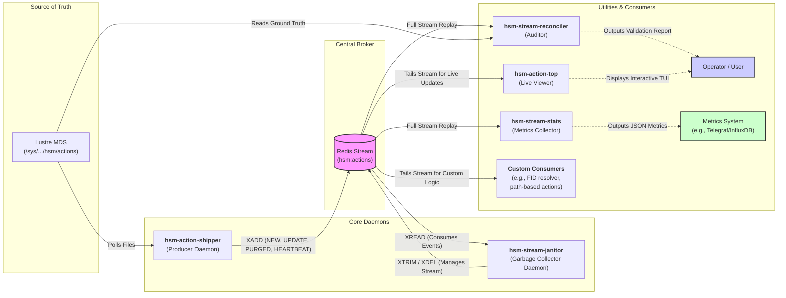

# Lustre HSM Action Stream

[](https://www.gnu.org/licenses/gpl-3.0)

A lightweight toolkit for shipping Lustre HSM events from MDT `hsm/actions` logs to a Redis stream, with tools for monitoring, metrics, and stream management.

---

## System Architecture

The `lustre-hsm-action-stream` suite consists of several components that work together to provide a real-time, persistent, and manageable event stream for Lustre HSM actions. The centralized stream is designed to be consumed by the provided utilities and by any number of custom clients to trigger external actions and automated workflows.

The diagram below illustrates the data flow and the role of each component:



---

## Components

This project provides the following command-line tools:

### `hsm-action-shipper` (Producer Daemon)

A daemon designed for reliable operation on each Lustre Metadata Server (MDS). It monitors `hsm/actions` files, processes log entries, and ships them as structured events to a central Redis stream.

#### Key Technical Features

*   **State-Change Detection:** At each poll interval, it calculates an MD5 hash of every line in the `hsm/actions` files. By comparing these hashes to its persistent local cache (`cache.json`), it deterministically generates event types:
    *   **`NEW`**: An action appears that was not in the cache.
    *   **`UPDATE`**: An action's line hash changes (e.g., its `status` field is modified).
    *   **`PURGED`**: An action that was in the cache is no longer present in the files.

*   **Liveness Heartbeating:** To support the `hsm-stream-janitor`, it sends a lightweight `HEARTBEAT` event for any action that has not changed state within a configurable `heartbeat_interval`. This proves the action is still live, even if it's in a long-term `WAITING` state, allowing the janitor to safely reap genuinely stale actions.

*   **Transactional Event Shipping:** The shipper operates on an "all-or-nothing" principle per cycle. Its local cache is only updated and saved to disk *after* a batch of events has been successfully written to Redis. If the Redis connection fails, the cache remains unchanged. The next poll cycle will then re-generate the exact same events and attempt to ship them again, guaranteeing at-least-once delivery.

*   **Graceful Shutdown & Resiliency:** Responds to `SIGINT`/`SIGTERM` to finish its current cycle before exiting. If Redis is unavailable, it attempts to reconnect with exponential backoff without dropping events.

### `hsm-stream-janitor` (Garbage Collector Daemon)

A state-driven garbage collector for the Redis action stream. Its primary purpose is to prevent the stream from growing infinitely by safely trimming events that are no longer part of any active HSM operation.

*   **State-Driven Trimming:** By consuming all events, it builds an in-memory model of all live actions. It periodically finds the oldest event ID that is still referenced by a live action and issues an `XTRIM` command to delete all older entries.

*   **Stale Action Reaping (Self-Healing):** If a `PURGED` event is missed (e.g., due to shipper downtime), the janitor uses a configurable `stale_action_timeout_seconds` to detect and remove "stale" actions from its state. This critical feature works in tandem with the shipper's `HEARTBEAT` events to unblock stream trimming and ensure the system is self-correcting.

### `hsm-stream-reconciler` (Auditor Utility)

A command-line utility to validate the integrity of the Redis stream data against the "ground truth" of the Lustre `hsm/actions` files. It builds one state model from the Lustre files and a second by replaying the stream, then compares them and reports on discrepancies like missing or extra actions.

### `hsm-action-top` (Live Viewer)

A `top`-like terminal dashboard for real-time monitoring of HSM activity. It connects to the Redis stream, builds an initial state, and then listens for live events to provide a continuously updating, aggregated view of all ongoing actions.

#### Example view

```
--- Lustre HSM Action Dashboard ---
Time: 2025-09-22 10:39:32 | Redis: Connected
Viewer Status: Bootstrap complete (269,124 events). Listening for live updates...
Live Actions: 268,506 | Last Event: 1s ago

--- Live Action Count by (MDT, Action, Status) ---
MDT         | ACTION  | STATUS     |      COUNT DIFF      
----------------------------------------------------------
elm-MDT0000 | ARCHIVE | STARTED    |     13,365 
elm-MDT0000 | ARCHIVE | SUCCEED    |        140 
elm-MDT0001 | ARCHIVE | STARTED    |     50,000 
elm-MDT0001 | ARCHIVE | WAITING    |     38,732 
elm-MDT0002 | ARCHIVE | STARTED    |    111,680 
elm-MDT0002 | ARCHIVE | SUCCEED    |          2 
elm-MDT0003 | ARCHIVE | STARTED    |     54,583 (+3,033)
elm-MDT0003 | ARCHIVE | WAITING    |          4 (+1)
```

### `hsm-stream-stats` (Metrics Collector)

A stateless command-line utility designed for integration with monitoring systems (e.g., Telegraf). On each run, it performs a full replay of the stream to generate an accurate point-in-time snapshot of the system state, outputting the result as a single JSON object.

---

## Redis Stream Event Structure

Events are added to a Redis stream via `XADD`. Each entry contains a single field, `data`, holding a JSON-encoded string.

**Example `UPDATE` payload:**
```json
{
  "event_type": "UPDATE",
  "action": "ARCHIVE",
  "fid": "0x2000057b4:0x1d648:0x0",
  "status": "STARTED",
  "mdt": "elm-MDT0000",
  "cat_idx": 520,
  "rec_idx": 36052,
  "timestamp": 1758517756,
  "raw": "lrh=[type=10680000 len=192 idx=520/36052] fid=[0x2000057b4:0x1d648:0x0] ... status=STARTED ...]"
}
```
**Example `HEARTBEAT` payload:**
```json
{
  "event_type": "HEARTBEAT",
  "mdt": "elm-MDT0000",
  "cat_idx": 520,
  "rec_idx": 36052,
  "timestamp": 1758517956
}
```

---

## Installation

This project is packaged as an RPM. After installation, the following files and directories are created:

*   **System Binaries:** `/usr/sbin/hsm-action-shipper`, `/usr/sbin/hsm-stream-janitor`, `/usr/sbin/hsm-stream-reconciler`, `/usr/sbin/hsm-stream-stats`
*   **User Binary:** `/usr/bin/hsm-action-top`
*   **Configuration:** `/etc/lustre-hsm-action-stream/`
*   **Systemd Services:** `hsm-action-shipper.service`, `hsm-stream-janitor.service`
*   **Cache Directory:** `/var/cache/hsm-action-shipper/`

---

## Usage

### `hsm-action-shipper` (on each MDS)

1.  **Configure:** Edit `/etc/lustre-hsm-action-stream/hsm_action_shipper.yaml` to set your `redis_host` and other parameters.
2.  **Enable and start the service:**
    ```bash
    systemctl enable --now hsm-action-shipper.service
    ```
3.  **Check status and logs:**
    ```bash
    systemctl status hsm-action-shipper.service
    journalctl -u hsm-action-shipper.service -f
    ```

### `hsm-stream-janitor` (on a central server)

1.  **Configure:** Edit `/etc/lustre-hsm-action-stream/hsm_stream_janitor.yaml` to point to your `redis_host`. The `stale_action_timeout_seconds` should be safely longer than the shipper's `heartbeat_interval`.
2.  **Enable and start the service:**
    ```bash
    systemctl enable --now hsm-stream-janitor.service
    ```
3.  **Check logs:**
    ```bash
    journalctl -u hsm-stream-janitor.service -f
    ```

### Other Utilities

*   **`hsm-stream-reconciler`:** Run on an MDS to validate the stream.
    ```bash
    # Validate against a specific Redis host, scoping to certain MDTs
    hsm-stream-reconciler --host my-redis.internal --mdts elm-MDT0000 elm-MDT0001
    ```
*   **`hsm-action-top`:** Run from any machine that can connect to Redis.
    ```bash
    # Connect to a specific Redis host with a 2-second refresh interval
    hsm-action-top --host my-redis.internal --interval 2
    ```
*   **`hsm-stream-stats`:** Typically run by a monitoring agent like Telegraf.
    ```bash
    # Output metrics as a JSON object
    hsm-stream-stats -c /etc/lustre-hsm-action-stream/hsm_stream_stats.yaml
    ```
