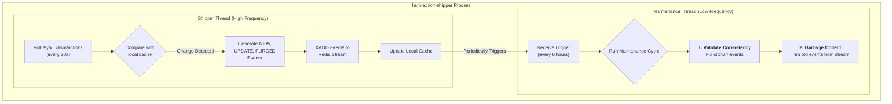

# Lustre HSM Action Stream

[](https://github.com/stanford-rc/lustre-hsm-action-stream/actions/workflows/ci.yml)
[](https://www.gnu.org/licenses/gpl-3.0)

A scalable and operationally simple toolkit for creating a real-time event stream from Lustre's Hierarchical Storage Management (HSM) actions.

This suite provides a self-healing producer daemon that runs on each Lustre Metadata Server (MDS) and a collection of consumer utilities for monitoring, metrics, and integrity auditing of Lustre/HSM actions. It is designed to give administrators and developers a persistent, reliable, and easily consumable view of all HSM activity across a Lustre file system.

## Quick Overview for Lustre Administrators

If you manage a Lustre filesystem with an HSM backend, you know that understanding what the HSM coordinator is doing can be challenging. The primary interface, `/sys/kernel/debug/lustre/mdt/*/hsm/actions`, is volatile and difficult to monitor across multiple servers.

This toolkit solves that problem by providing:
*   **A Centralized View:** A single Redis instance becomes the central broker for all HSM events (`archive`, `restore`, `remove`) from all MDTs.
*   **Live Monitoring:** Use `hsm-action-top` for a live `top`-like dashboard of HSM activity or `hsm-stream-tail` to see a real-time log of events with file paths across all MDTs.
*   **Metrics**: The streams maintain the full event history required to reconstruct the state of all currently live actions. Use the stateless `hsm-stream-stats` tool to generate a point-in-time JSON report by replaying this history, ideal for integration with monitoring systems like Telegraf and Grafana.
*   **Operational Simplicity:** The core `hsm-action-shipper` daemon is self-healing and self-managing. It automatically handles MDT failovers and performs its own garbage collection, requiring minimal administrative overhead.
*   **Extensibility:** A simple Python API allows you to easily build custom consumers to trigger workflows based on HSM events.

## Examples of Consumer Tools

#### `hsm-action-top`: The Live Dashboard
A `top`-like terminal dashboard for real-time monitoring of HSM activity.
```
--- Lustre HSM Action Dashboard ---
Time: 2025-10-02 10:30:15 | Redis: Connected
Viewer Status: Listening for live updates...
Live Actions: 351,204 | Total Events Processed: 750,112 | Last Event: 0s ago

--- Live Action Count by (MDT, Action, Status) ---
MDT         | ACTION  | STATUS     |      COUNT DIFF
----------------------------------------------------------
elm-MDT0000 | ARCHIVE | STARTED    |     50,000 
elm-MDT0000 | ARCHIVE | WAITING    |     25,000 
elm-MDT0001 | RESTORE | STARTED    |        125 (+5)
elm-MDT0002 | ARCHIVE | STARTED    |    140,000 
elm-MDT0002 | ARCHIVE | SUCCEED    |        210 (-15)
elm-MDT0002 | ARCHIVE | WAITING    |     85,869 
elm-MDT0003 | REMOVE  | FAILED     |          2 (+2)
```

#### `hsm-stream-tail`: The Real-Time Log
A `tail -f` for your HSM actions, resolving file paths for easy identification.
```bash
$ hsm-stream-tail
```
```
Tailing streams with prefix 'hsm:actions:*'. Press Ctrl+C to exit.
...
2025-10-02 10:32:05 [elm-MDT0001] RESTORE  STARTED  -> /lustre/project/data/simulation_run_42/output.dat (id: 1759453925123-0)
2025-10-02 10:32:07 [elm-MDT0002] ARCHIVE  SUCCEED  -> /lustre/project/data/raw/microscope_img_22.tiff (id: 1759453927456-5)
2025-10-02 10:32:08 [elm-MDT0001] RESTORE  SUCCEED  -> /lustre/project/data/simulation_run_42/output.dat (id: 1759453925123-1)
```

#### `hsm-stream-stats`: The Metrics Collector
Generates a point-in-time JSON report, perfect for ingestion by monitoring tools.
```bash
$ hsm-stream-stats
```
```json
{
  "summary": {
    "total_live_actions": 351204,
    "oldest_live_action_age_seconds": 4500,
    "total_events_replayed": 750112,
    "total_stream_entries": 480550,
    "streams": {
      "hsm:actions:elm-MDT0000": { "length": 150000, ... },
      "hsm:actions:elm-MDT0001": { "length": 550, ... }
    }
  },
  "breakdown": [
    { "mdt": "elm-MDT0000", "action": "ARCHIVE", "status": "STARTED", "count": 50000 },
    { "mdt": "elm-MDT0001", "action": "RESTORE", "status": "STARTED", "count": 125 }
  ]
}
```

---

## Installation and Configuration

This project is designed to be built into an RPM for easy deployment on RHEL-based systems (like Rocky Linux or AlmaLinux).

### Prerequisites
1.  A running **Redis** server (version 5 or later) accessible from all Lustre MDS nodes.
2.  Lustre client tools (for `lfs`) installed on any machine where you intend to run `hsm-stream-tail`.
3.  Build tools on your build machine: `rpm-build`, `python3-devel`, `pyproject-rpm-macros`.

### 1. Build the RPM
On your build machine, clone the repository and use `rpmbuild` to create the package.
```bash
# Clone the repository
git clone https://github.com/stanford-rc/lustre-hsm-action-stream.git
cd lustre-hsm-action-stream

# Create a source tarball
tar -czvf lustre-hsm-action-stream-0.3.0.tar.gz --exclude=.git --transform='s,^,lustre-hsm-action-stream-0.3.0/,' .

# Build the RPM (output will be in ~/rpmbuild/RPMS/noarch/)
rpmbuild -ta lustre-hsm-action-stream-0.3.0.tar.gz
```

### 2. Deploy on Lustre Metadata Servers (MDS)
Install the generated RPM on **each** of your Lustre MDS nodes. This installs the `hsm-action-shipper` daemon and its dependencies.

```bash
# On each MDS:
dnf install python-lustre-hsm-action-stream-0.3.0-1.el9.noarch.rpm
```

### 3. Configure and Start the Service
On each MDS, you only need to configure the Redis connection and start the service.

1.  **Edit the configuration file:**
    ```bash
    vi /etc/lustre-hsm-action-stream/hsm_action_shipper.yaml
    ```

2.  **Set your Redis connection details.** At a minimum, you must change `redis_host`. It's also highly recommended to pick a dedicated `redis_db` number (0-15) that is not used by other applications.
    ```yaml
    # --- 1. Redis Connection (REQUIRED) ---
    # You MUST edit 'redis_host' to point to your Redis server.
    redis_host: "my-redis-server.cluster.local"
    redis_port: 6379

    # The Redis database number to use.
    redis_db: 1
    ```

3.  **Enable and start the daemon:**
    ```bash
    systemctl enable --now hsm-action-shipper.service
    ```

4.  **Verify it's running:**
    ```bash
    systemctl status hsm-action-shipper.service
    journalctl -u hsm-action-shipper.service -f
    ```
Repeat these steps for every MDS in your cluster. Each shipper will automatically find the local MDTs it needs to monitor.

### 4. Using the Consumer Tools
Install the same RPM on any client machine or management node where you want to run the monitoring tools.

1.  **Configure Redis:** Edit the respective config files in `/etc/lustre-hsm-action-stream/` (e.g., `hsm_stream_tail.yaml`) to point to the same `redis_host` and `redis_db`.
2.  **Run the tools:**
    ```bash
    # See a live dashboard of activity
    hsm-action-top

    # Tail the event stream (requires Lustre client tools installed)
    hsm-stream-tail --from-beginning

    # Get a JSON metrics snapshot for monitoring
    hsm-stream-stats
    ```
---

## Design and Technical Features

### System Architecture

The architecture is designed for scalability, robustness, and operational simplicity. The core principle is to create a separate, self-contained Redis stream for each Lustre MDT. This logical partitioning simplifies consumers and isolates data streams from one another.

The `hsm-action-shipper` daemon, running on each MDS, is a fully autonomous agent responsible for both producing events and maintaining the long-term health of the streams it owns.


### The `hsm-action-shipper`: A Self-Healing Producer

The shipper daemon is the heart of the system. It runs on each MDS and performs two distinct roles in separate threads.



#### 1. High-Frequency Event Shipping
*   **State-Change Detection:** At each poll interval (e.g., 20s), it calculates an MD5 hash of every line in the `hsm/actions` files. By comparing these hashes to a persistent local cache, it deterministically generates `NEW`, `UPDATE`, and `PURGED` events.
*   **Dynamic MDT Discovery:** The shipper re-scans the filesystem on every poll cycle. This allows it to automatically start monitoring an MDT that fails over *to* its host, and automatically stop monitoring (and clean up its state for) an MDT that fails over *away* from its host, all without a restart.
*   **Transactional Shipping:** The shipper's local cache is only updated *after* events are successfully written to Redis. If Redis is unavailable, the cache remains unchanged, and the shipper will re-send the same events on the next cycle, guaranteeing at-least-once delivery.

#### 2. Low-Frequency Maintenance Cycle
On a long, configurable interval (e.g., every 6 hours), the shipper performs a background maintenance task on the streams it owns:
*   **Consistency Validation (Self-Healing):** It replays its own streams to find "orphan" actions—entries that exist in Redis but no longer on the filesystem (e.g., due to a missed `PURGED` event). It then injects a corrective `PURGED` event to fix the inconsistency.
*   **Garbage Collection (Trimming):** After validation, it identifies the oldest event ID belonging to any currently live action. It then issues an `XTRIM` command to Redis to delete all older events from the stream, preventing infinite growth and managing memory usage.
*   **Aggressive Trimming:** If a trim operation removes more than a configured `aggressive_trim_threshold` (e.g., 5000) of entries, it immediately re-trims, ensuring that large backlogs are cleared efficiently.

### Public Consumer API (`StreamReader`)

For building custom integrations, the project provides a simple, high-level Python API. The `StreamReader` class handles all the complexity of stream discovery, multi-stream reading, and robust reconnection.

**Example: A custom alerter for failed actions**
```python
#!/usr/bin/env python3
# alert_on_failure.py
from lustre_hsm_action_stream.consumer import StreamReader
import logging

# Configure logging for the consumer library
logging.basicConfig(level="INFO")

# Create a reader that will discover all streams with the prefix 'hsm:actions'
reader = StreamReader(
    host='redis.cluster.local',
    port=6379,
    db=1,
    prefix='hsm:actions'
)

print("Monitoring for failed HSM actions...")
try:
    # This generator blocks and yields events as they arrive from any MDT.
    for event in reader.events():
        if event.data.get('status') == 'FAILED':
            mdt = event.data.get('mdt')
            fid = event.data.get('fid')
            print(f"ALERT: Action failed on {mdt} for FID {fid}!", file=sys.stderr)
            # Add custom logic here, e.g., send an email or a Slack notification.

except KeyboardInterrupt:
    print("Stopped.")
```

## Credits

This project is maintained and used in production by [Stanford Research Computing](https://srcc.stanford.edu/)
on [Elm Cold Storage](https://docs.elm.stanford.edu/).

### Acknowledgments

*   **Kilian Cavalotti:** For valuable contributions to the architectural review and design discussions.
*   **Various AI:** For confidently providing the wrong answers that ultimately led to the right ones.

Have questions? Feel free to contact us at srcc-support@stanford.edu

<div align="center">
  <a href="http://www.stanford.edu" ></a><br><br>
</div>
